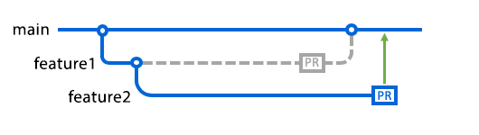
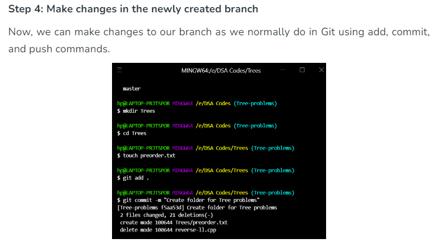
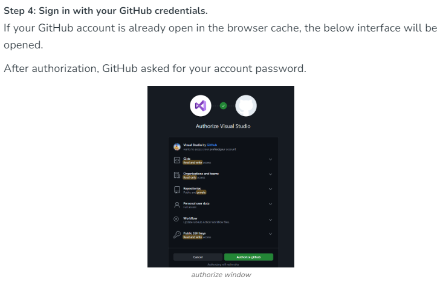

# SE-Assignment-4
Assignment: GitHub and Visual Studio
Instructions:
Answer the following questions based on your understanding of GitHub and Visual Studio. Provide detailed explanations and examples where appropriate.

Questions:
Introduction to GitHub:

What is GitHub, and what are its primary functions and features? Explain how it supports collaborative software development.

**WHAT IS GITHUB**
GitHub is a web-based platform built around Git, a distributed version control system. It enhances Git's functionality by providing a collaborative environment for developers to store, manage, and share their code repositories. 

**Here are the primary functions and features of GitHub:**

1. **Repository Hosting Git Repositories:**
GitHub hosts Git repositories, allowing developers to store their code and collaborate on projects.Remote Access: Developers can access repositories from anywhere, facilitating remote work and collaboration.

2. **Version Control Commit History:**
GitHub tracks changes made to code files over time through commits.
Branching and Merging: Supports branching to work on features or fixes independently and merging changes back into the main codebase.

3. **CollaborationPull Requests:** 
Developers can propose changes to a repository through pull requests, which allow for code review, discussion, and eventual merging into the main branch.Issue Tracking: GitHub provides tools for issue management, allowing teams to track bugs, feature requests, and tasks.

4. **Code ReviewPull Request Reviews:** 
Facilitates peer code review through comments, suggestions, and approvals directly within the GitHub interface.
Inline Comments: Reviewers can leave comments on specific lines of code to discuss changes and provide feedback.

5. **Project Management Projects:**
GitHub Projects offer Kanban-style boards to organize tasks, track progress, and prioritize work within repositories.
Automation: Integrates with third-party services and workflows through GitHub Actions for automated testing, deployment, and other CI/CD tasks.

6. **Community and Social Coding Explore and Discover:**
Users can explore public repositories, discover trending projects, and follow developers or organizations.
Contributions: GitHub tracks and displays contributions to open source projects, fostering a community-driven approach to software development.

7. **Documentation and Wikis Wiki Pages:** 
Supports wiki creation for repositories to document project details, guidelines, and instructions.
Markdown Support: GitHub renders Markdown files, making it easy to write and format documentation directly within repositories.

8. **Integration and ExtensibilityAPI:** 
GitHub provides a robust API for integrating with external tools, automating workflows, and extending functionality.
Third-Party Integrations: Integrates with various tools and services such as CI/CD pipelines, project management tools, and code quality tools.

9. **Security and Permissions Access Control:** 
GitHub allows repository owners to manage permissions, control access levels (read, write, admin), and collaborate securely.Security Features: Provides features like two-factor authentication (2FA), code scanning for vulnerabilities, and dependency management alerts.

10. **Education and Learning GitHub Learning Lab:** 
Offers interactive courses and tutorials on Git, GitHub, and various programming topics.
Student Developer Pack: Provides free access to tools and resources for students and educators.

GitHub supports collaborative software development through a variety of features and tools designed to streamline communication, coordination, and contribution among team members and the broader developer community. 

**Here’s how GitHub facilitates collaborative software development:**

1. **Pull Requests (PRs) Purpose:** Pull requests allow developers to propose changes to a repository and initiate a discussion around those changes.
**Review Process:** Team members can review the proposed changes, leave comments, suggest modifications, and approve or reject the pull request.
**Code Quality**: PRs ensure that changes are thoroughly reviewed before being merged into the main branch, maintaining code quality and reducing errors.

2. **Issue Tracking Centralized Management**: GitHub's issue tracker helps teams manage tasks, bugs, feature requests, and enhancements.
**Assignment and Prioritization:** Issues can be assigned to team members, labeled, prioritized, and tracked throughout their lifecycle.
**Integration:** Issues can be linked to pull requests, providing context and visibility into the development process.

3. **Branching and Merging Isolation of Work:** Developers can create branches to work on features or fixes independently, preventing conflicts with the main codebase.

4. **Code Reviews Collaborative Feedback:** Reviewers can provide feedback directly on code changes, suggesting improvements, discussing implementation details, and ensuring adherence to coding standards.

5. **Project Management Kanban Boards:** GitHub Projects offer customizable Kanban-style boards to visualize tasks, track progress, and manage workflows.

6. **Documentation and Wikis Knowledge Sharing**: GitHub Wikis allow teams to document project details, guidelines, best practices, and troubleshooting steps.

7. **Community Engagement Open Source Contributions:** GitHub fosters a thriving ecosystem of open source projects, enabling developers worldwide to contribute, collaborate, and improve software together.

Repositories on GitHub:

A repository, often abbreviated as "repo," is a central location where all the files and resources for a project are stored and managed. In the context of GitHub:

Version Control: Repositories are managed using Git, a distributed version control system. Git tracks changes to files within the repository, allowing developers to collaborate, make changes, and revert to previous versions as needed.

Codebase: Each repository typically contains all the source code files, configuration files, documentation, and other resources related to a specific project or software application.

What is a GitHub repository? Describe how to create a new repository and the essential elements that should be included in it.

As we said, **A repository, often abbreviated as "repo," is a central location where all the files and resources for a project are stored and managed. In the context of GitHub:**

Version Control with Git:

Explain the concept of version control in the context of Git. How does GitHub enhance version control for developers?
Branching and Merging in GitHub:

Version control, also known as source control, is the practice of tracking and managing changes to software code. Version control systems are software tools that help software teams manage changes to source code over time.

Branching and Merging: GitHub allows users to create branches within repositories. Developers can work on new features or changes in separate branches without affecting the main codebase. After completing work in a branch, they can initiate a pull request to merge their changes back into the main branch.

What are branches in GitHub, and why are they important? Describe the process of creating a branch, making changes, and merging it back into the main branch.
Pull Requests and Code Reviews:

Branches allow you to develop features, fix bugs, or safely experiment with new ideas in a contained area of your repository. You always create a branch from an existing branch. Typically, you might create a new branch from the default branch of your repository. 

Branches allow you to develop features, fix bugs, or safely experiment with new ideas in a contained area of your repository. You always create a branch from an existing branch.

 **The process of creating a branch, making changes, and merging it back into the main branch.**

Pull Requests and Code Reviews:

What is a pull request in GitHub, and how does it facilitate code reviews and collaboration? Outline the steps to create and review a pull request.

Pull requests let you tell others about changes you've pushed to a branch in a repository on GitHub. Once a pull request is opened, you can discuss and review the potential changes with collaborators and add follow-up commits before your changes are merged into the base branch.

Pull requests are a cornerstone of Git collaboration, especially on platforms like GitHub. They allow developers to notify team members about changes they've pushed to a branch in a repository. Through pull requests, team members can review, discuss, and refine code before it's merged into the main branch.

GitHub Actions:

Explain what GitHub Actions are and how they can be used to automate workflows. Provide an example of a simple CI/CD pipeline using GitHub Actions.

Overview. GitHub Actions is a continuous integration and continuous delivery (CI/CD) platform that allows you to automate your build, test, and deployment pipeline. You can create workflows that build and test every pull request to your repository, or deploy merged pull requests to production.

Introduction to Visual Studio:

What is Visual Studio, and what are its key features? How does it differ from Visual Studio Code?
Integrating GitHub with Visual Studio:

Visual Studio is an integrated development environment (IDE) created by Microsoft for developing applications on Windows, macOS, Linux, and web platforms. It supports a wide range of programming languages and frameworks, making it a versatile tool for developers across different domains. 

**key features**
1. Integrated Development Environment (IDE)
2. Language and Platform Support
3. Cross-Platform Development
4. Productivity Tools
5. Collaboration and Team Development
6. Cloud Development
7. Community and Support

The main difference between Visual Studio vs Visual Studio Code is that the first one is a comprehensive Integrated Development Environment (IDE) tool for software development, while the second one is an Extension-based Code Editor. It only needs a little space to run.

Describe the steps to integrate a GitHub repository with Visual Studio. How does this integration enhance the development workflow?
Debugging in Visual Studio:

Integrating a GitHub repository with Visual Studio enhances the development workflow in several significant ways, facilitating collaboration, version control, and seamless project management.

Explain the debugging tools available in Visual Studio. How can developers use these tools to identify and fix issues in their code?
Debugging in Visual Studio:

You might debug code by using a performance profiler. Or, you might debug by using a debugger. A debugger is a very specialized developer tool that attaches to your running app and allows you to inspect your code. In the debugging documentation for Visual Studio, this is typically what we mean when we say "debugging".

Collaborative Development using GitHub and Visual Studio:

Discuss how GitHub and Visual Studio can be used together to support collaborative development. Provide a real-world example of a project that benefits from this integration.

GitHub is a cloud-based service for storing and sharing source code. Using GitHub with Visual Studio Code lets you share your source code and collaborate with others right within your editor.

Community and Learning Resources:

GitHub Community: The project benefits from GitHub’s vibrant community of developers and open source projects. Team members can contribute to open source projects, seek help from the community, and stay updated with industry trends and best practices.

Submission Guidelines:
Your answers should be well-structured, concise, and to the point.
Provide real-world examples or case studies wherever possible.
Cite any references or sources you use in your answers.
Submit your completed assignment by [due date].
